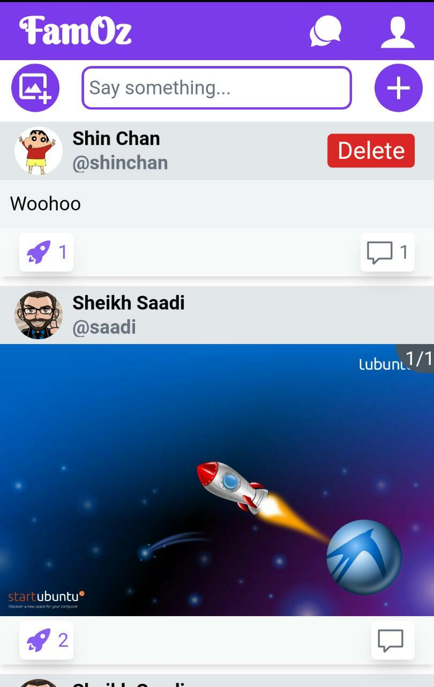
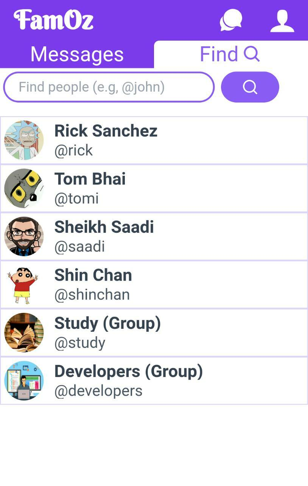
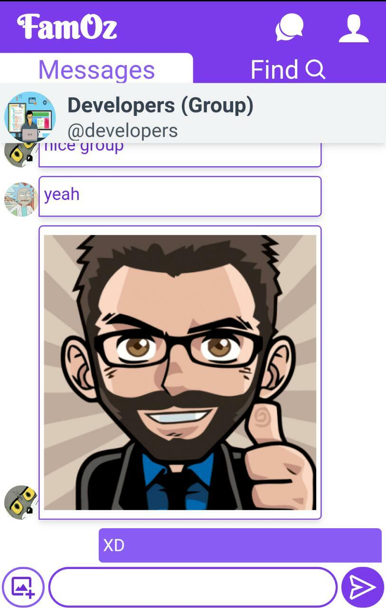
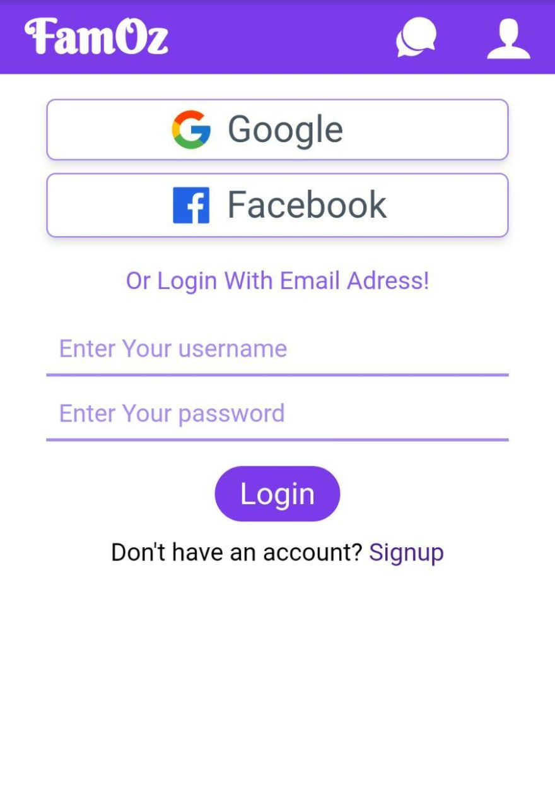

# Social Media App built with MERN Stack

See [demo here](https://ozfam.herokuapp.com/)

## Features
- User can login with email-password, Google or Facebook
- User can View Posts and comments
- User can make posts and comments
- Can connect with people through chat
- User can edit his profile
---

## Frontend Technologies Used
- React
- React-router
- axios
- TailwindCSS
---
## Backend Technologies Used
- ExpressJS
- MongoDB
- PassportJS
- Socket.io
- Cloudinary Api

## Previews

